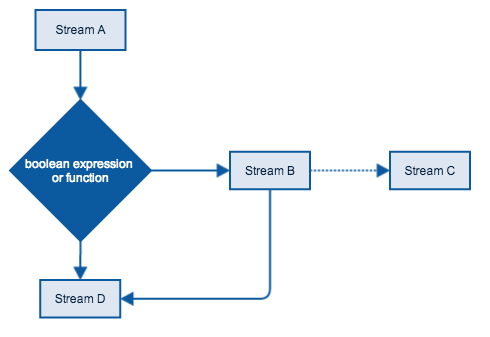

detour-stream
=============

Use boolean expressions/functions to conditionally attach a stream as a *detour* or an *alternative* destination stream.

This module is inspired by [gulp-if](https://github.com/robrich/gulp-if). The difference is that this module is not created for [gulp](https://github.com/gulpjs/gulp).

Following the above diagram, if **bool** is *unsatisfied*, then data from **stream A** will pass through to **Stream D**.

Otherwise, data will pipe to **Stream B** whenever **bool** is *satisfied*.

If **branch** is true, then data will **not** be piped back to **Stream D**. This is useful when emulating *if/else* with streams.

API
===

## detour(bool, stream [, branch])

`detour` will pipe data to stream appropriately whenever `bool` is satisfied.

### Parameters

#### bool

Type: `boolean`, or `function`

If a function is given, then the function is passed a data chunk. The function should return a `boolean`.

#### stream

Stream for detour-stream to pipe data into whenever **bool** satisfies.

#### branch

Type: `boolean`

Default: `false`

`branch` controls the flow behavior of whether detour-stream should pipe `stream` back to the main stream (i.e. detour stream).

If `true`, then gulp-if **will not** pipe `stream` back to the main stream. This emulates *if/else* stream flow.

License
=======

MIT.
